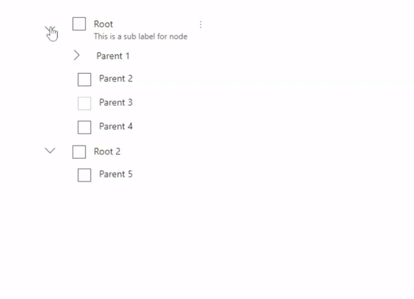
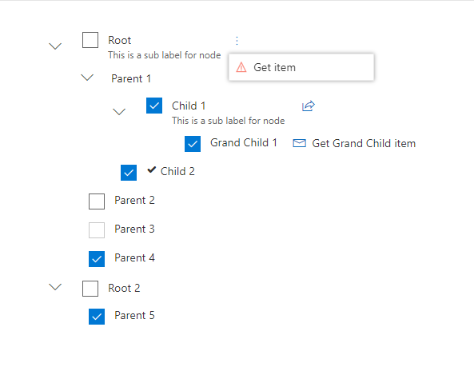
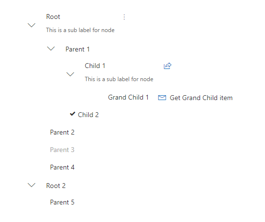

## TreeView control

This graphical control allows to present a hierarchical view of information. Each tree item can have a number of subitems. This is often visualized by indentation in a list. An tree item can be expanded to reveal subitems (if exists), and collapsed to hide subitems.


Here is an example of the control in action:



**With all possible options**



**Without check boxes or when selection mode is 'None'**



## How to use this control in your solutions

- Check that you installed the `@pnp/spfx-controls-react` dependency. Check out the [getting started](../../#getting-started) page for more information about installing the dependency.
- Import the following modules to your component:

```TypeScript
import { TreeView, ITreeItem } from "@pnp/spfx-controls-react/lib/TreeView";
```

- Use the `TreeView` control in your code as follows:

```TypeScript
<TreeView 
    items={treeitems}
    defaultExpanded={false}
    selectionMode=SelectionMode.Multiple
    selectChildrenIfParentSelected={true}
    showCheckboxes={true}    
    onSelect={this.onTreeItemSelect}
    onExpandCollapse={this.onTreeItemExpandCollapse}
    onRenderItem={this.renderCustomTreeItem} />
```

- With the `onSelect` property you can capture the event of when the tree item in the TreeView has changed the selection:

```typescript
private onTreeItemSelect(items: ITreeItem[]) {
    console.log("Items ", items);
}
```

- With the `onExpandCollapse` property you can capture the event of when the tree item in the TreeView has expanded or collapsed:

```typescript
private onTreeItemExpandCollapse(item: ITreeItem, isExpanded: boolean) {
    console.log((isExpanded ? "item expanded: " : "item collapsed: ") + item);  
}
```

- Each tree item in the `treeitems` property is defined as `ITreeItem` as follows:

Interface `ITreeItem`

| Property | Type | Required | Description |
| ---- | ---- | ---- | ---- |
| key | string | yes | The unique ID of the tree item. |
| label | string | yes | Text displayed next to checkbox. |
| subLabel | string | no | The sub label of the tree item. |
| iconProps | IIconProps | no | Custom icon to be rendered before label. |
| disabled | boolean | no | Specify if the tree item needs to be disabled. Default is false |
| selectable | boolean | no | Specify if the tree item can be selected. Default is true|
| data | any | no | Specify an additional data of the tree item. |
| treeItemActions | ITreeItemActions | no | Specify list of actions for the tree item. |
| children | ITreeItem[] | no | Specify list of child tree items. |

Interface `ITreeItemActions`
| Property | Type | Required | Description |
| ---- | ---- | ---- | ---- |
| actions | ITreeItemAction | yes | Specify list of actions for the tree item. |
| treeItemActionsDisplayMode | TreeItemActionsDisplayMode | no | Specify the display mode of the tree item actions. |

Interface `ITreeItemAction`
| Property | Type | Required | Description |
| ---- | ---- | ---- | ---- |
| id | string | yes | Unique id of the action |
| title | string | yes | Action title |
| iconProps | IIconProps | no | Name of the icon to be used to display action |
| hidden | boolean | no | Specify if the action is hidden. This could be used for instance when you want to invoke the action right after rendering. |
| invokeActionOnRender | boolean | no | Specifies if you want to invoke the action on render |
| actionCallback | (currentTreeItem: ITreeItem) => void | yes | Method to be executed when action is fired |

Enum `TreeItemActionsDisplayMode`

Specifies the display mode of the tree item action.
| Value |
| ---- |
| Buttons |
| ContextualMenu |

## Custom Rendering
You can fully customize how tree items are rendered by providing the onRenderItem callback function and returning whatever JSX.Element you want.

For example, you can define your function in a tsx file like this:

```typescript
import * as React from 'react';

export const renderCustomTreeItem = (item: ITreeItem): JSX.Element => {
    return (
        <span>
            <i className={"ms-Icon ms-Icon--" + item.iconProps.iconName} style={{paddingRight:'4px'}}/>
            {item.label}
        </span>
    );
};
```

## Implementation

The TreeView control can be configured with the following properties:

| Property | Type | Required | Description |
| ---- | ---- | ---- | ---- |
| items | ITreeItem[] | yes | An array of tree items to display. refer [example](#example-of-properties-object-used-to-render-control-as-in-main-screenshot) |
| defaultExpanded | boolean | no | Specify if the tree items are displayed as expanded by default (defaults to false)|
| selectionMode | enum | no | Specify the selection mode of tree view (defaults to Single selection)|
| selectChildrenIfParentSelected | boolean | no | Specify if the childrens should be selected when parent item is selected (defaults to false)|
| showCheckboxes | boolean | yes | Specify if the checkboxes should be displayed for selection|
| onExpandCollapse | function | no | Defines a onExpandCollapse function to raise when the tree item has expanded or collapsed.|
| onSelect | function | no | Captures the event of when the tree item selection has changed.|
| onRenderItem | function | no | Optional callback to provide custom rendering of the item (default is simple text of item label and a checkbox for selection)|

Enum `SelectionMode`

Specifies the the selection mode of tree item.
| Value |
| ---- |
| Single |
| Multiple |
| None |

## Example of array of items used to render control as in first screenshot.

```typescript

        items: [
          {
            key: "R1",
            label: "Root",
            subLabel: "This is a sub label for node",
            treeItemActions: {
              actions: [{
                title: "Get item",
                iconProps: {
                  iconName: 'Warning',
                  style: {
                    color: 'salmon',
                  },
                },
                id: "GetItem",
                actionCallback: async (treeItem: ITreeItem) => {
                  console.log(treeItem);
                }
              }],
              treeItemActionsDisplayMode: TreeItemActionsDisplayMode.ContextualMenu
            },
            children: [
              {
                key: "1",
                label: "Parent 1",
                selectable: false,
                children: [
                  {
                    key: "3",
                    label: "Child 1",
                    subLabel: "This is a sub label for node",
                    treeItemActions: {
                      actions: [{
                        iconProps: {
                          iconName: 'Share'
                        },
                        id: "GetItem",
                        actionCallback: async (treeItem: ITreeItem) => {
                          console.log(treeItem);
                        }
                      }],
                      treeItemActionsDisplayMode: TreeItemActionsDisplayMode.Buttons
                    },
                    children: [
                      {
                        key: "gc1",
                        label: "Grand Child 1",
                        treeItemActions: {
                          actions: [{
                            title: "Get Grand Child item",
                            iconProps: {
                              iconName: 'Mail'
                            },
                            id: "GetItem",
                            actionCallback: async (treeItem: ITreeItem) => {
                              console.log(treeItem);
                            }
                          }],
                          treeItemActionsDisplayMode: TreeItemActionsDisplayMode.Buttons
                        }
                      }
                    ]
                  },
                  {
                    key: "4",
                    label: "Child 2",
                    iconProps: skypeCheckIcon
                  }
                ]
              },
              {
                key: "2",
                label: "Parent 2"
              },
              {
                key: "5",
                label: "Parent 3",
                disabled: true
              },
              {
                key: "6",
                label: "Parent 4",
                selectable: true
              }
            ]
          },
          {
            key: "R2",
            label: "Root 2",
            children: [
              {
                key: "8",
                label: "Parent 5"
              }
            ]
          }
        ]
```

