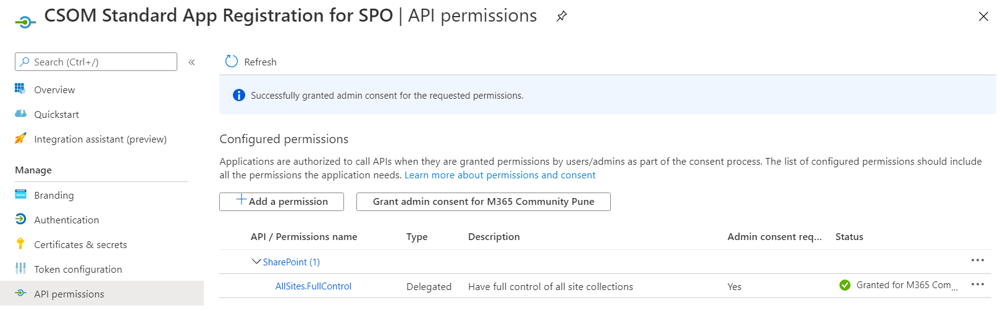
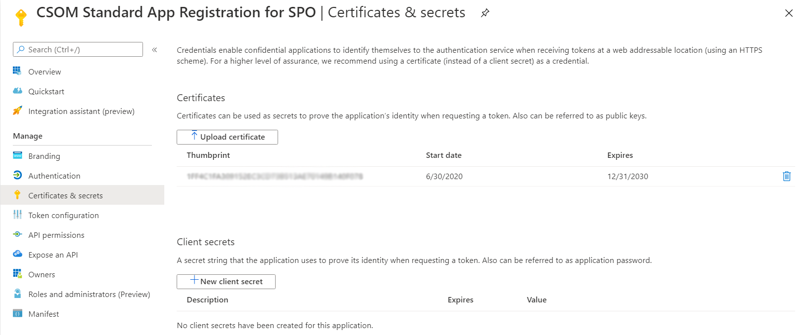
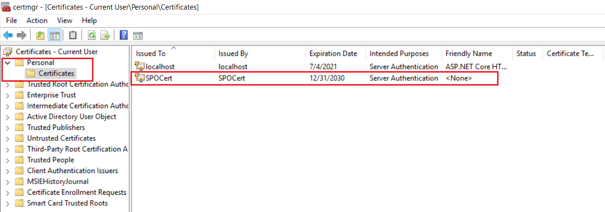

## .NET Standard version of SharePoint Online CSOM APIs (CSOM.NET.Standard.SPO)

It is recommended to use Microsoft Graph APIs whenever possible, but if you need to use capabilities which are not yet exposed within the Microsoft Graph, you might need to fall back on the SharePoint Online CSOM APIs.

New version of the SharePoint Online CSOM NuGet package includes .NET Standard versions of the CSOM APIs. This enables you to take advantage of the SharePoint CSOM API surface within your .NET Core based solutions, which unblocks you to use the latest versions of the Microsoft Azure services. 

In simple words, authentication is completely independent of CSOM library now. Since .NET Standard CSOM now uses OAuth for authentication, it's up to the developer to get an access token and pass it along with the call to SharePoint Online. The CSOM library does not care how the access token was fetched.

When making app-only calls to SharePoint Online, we can either use an Azure AD app registration (with the Client Certificate) or we can use SharePoint App-Only authentication created via the AppRegNew.aspx and AppInv.aspx pages.

Let's start by creating an App Registration in the Azure AD portal 


Configure it with the Certificate, SPO API permissions etc.


Add the certificate (.pfx) to your local machine certificates (certmgr.msc)


### VS 2019 Solution
The solution is developed using Visual Studio 2019 as .NET Core console application.

Below are the NuGet packages used:
1. Microsoft.SharePointOnline.CSOM (v16.1.20211.12000)
2. Microsoft.Identity.Client (v4.15.0)

### Building the code

```bash
1. Run a NuGet package restore
In VS, click Tools > NuGet Package Manager > Package Manager Console
dotnet restore

2. Right click on solution > Restore NuGet Packages
```

